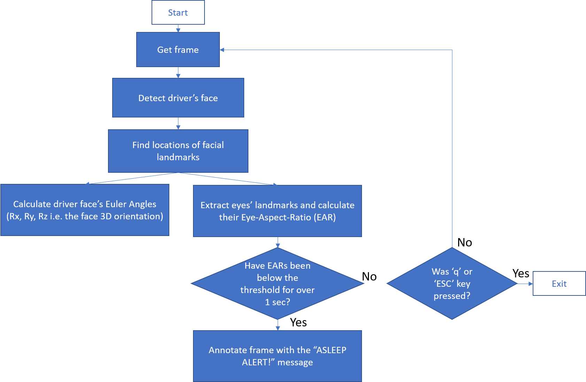

# Driver Attentiveness Monitoring System
A Computer Vision based approach to monitor a driver's attention to the road while driving.

## Setting Up the Environment
Linux users:
1. Create a virtual environment (optional, but recommended).
2. `git clone https://github.com/achandec/Driver-Attentiveness-Monitoring-System.git ~/DAMS`
3. `cd ~/DAMS`
4. `./setup.sh`

## Basic Usage
1. activate your virtual environment (user dependent e.g. `activate <virtualenv_name>`, `conda activate <virtualenv_name>`, `workon <virtualenv_name>`...)
2. `cd ~/DAMS`
3. `python3 mainFile.py`

## Introduction
  A Driver Attentiveness Monitoring System (DAMS) system usually takes part within an autonomous vehicle (AV) and its task is to track the driver’s attention when the car is in autonomous mode. The idea is that autnomous-driving systems are not infallible, and as such, it is necessary that the driver is attentive to the road and its surroundings in order to be able to react, in a timely manner, in case of failure. Hence, DAMS main purpose is safety.

  The scope of my work is to incorporate a new approach to monitor driver’s attention using a computer vision techniques. My initial idea was to monitor facial features such as face pose, gaze, eye openness and detect facial landmarks, such as eyes, pupils, and so on, in order to ascertain if a driver was paying attention. My work also included researching state-of-the-art computer vision papers to accomplish this, setting up environment, and debugging both the code and hardware used for this project. This project is still on-going to this date (5/11/2020) and I will continue to update the code.

## Accomplishments
  I have put together a single threaded application that enables us to stream video from a Logitech C920 webcam connected via USB port to the NVIDIA Jetson AGX Xavier module. In addition, I can successfully track real-time facial landmarks of the driver’s face and calculate the driver’s face orientation (Euler Angles: Rx, Ry, Rz) in real time. Also, I am capable of detecting if the driver has fallen asleep by tracking if the eye aspect ratio (EAR) has fallen below a dynamic EAR threshold for approximately a second (this time length can be modified). 

## Work Done
  Find below the flow diagram of the code to get the big picture of how it works.
  

    
  

  
